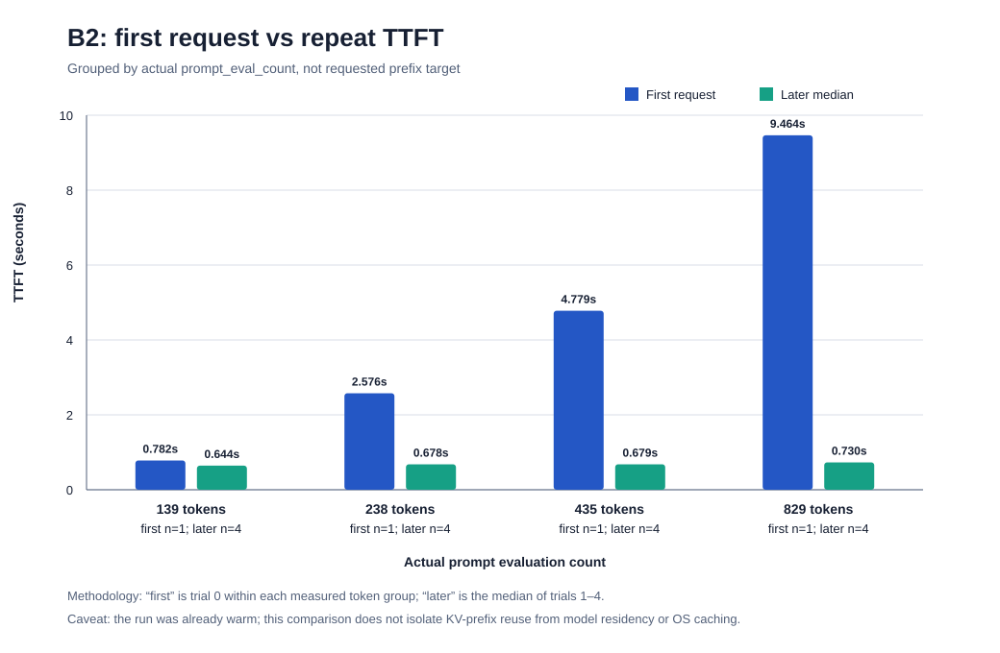
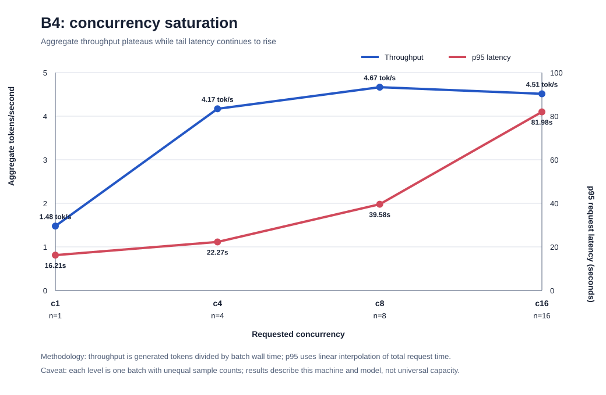

# Native Ollama Baseline Report

Artifact: `benchmarks/results/baseline.json`  
Run: `20260720T223511Z-83ca5757`  
Environment: Ubuntu/WSL2 calling Ollama 0.32.1 on the Windows host  
Primary model: `qwen2.5:3b`; secondary model: `qwen2.5-coder:7b`

## Executive Finding

All 71 trials completed in 11m58s without persisting prompt bodies. The run supports a local
diagnostic product, not a proxy-performance claim. Native Ollama already shows a large residency
benefit, native repeated-prefill behavior, dual-model pressure, and concurrency saturation.

## Results

| Scenario | Evidence | Safe interpretation |
|---|---:|---|
| B0 runtime-cold | 15.594 s trimmed median TTFT; 1.072 s trimmed SD | Residency-cleared requests are slow on this run. This is not reboot/physical cold. |
| B1 stable prefix | 0.635 s median TTFT; 95.93% below B0 | Resident/prewarmed native Ollama is much faster; the difference is confounded and is not isolated KV reuse. |
| B2 prefix sweep | First TTFT 0.782/2.576/4.779/9.464 s; repeat medians 0.644/0.678/0.679/0.730 s | First-prefill cost rises with actual prompt length, followed by cheap native repeats. |
| B3 switching | First 7B TTFT 43.739 s; later 3B/7B medians 6.908/7.878 s; zero evictions | Both models were API-visible, but coexistence did not mean hot or cost-free switching. |
| B4 concurrency | Peak 4.665 tok/s at c8; c16 4.513 tok/s and 81.98 s p95 | A descriptive queue/saturation signal exists around c8; one ordered batch per level is not a capacity claim. |

## Methodology Limits

- B0 unloads Ollama residency but does not clear the OS page cache. Raw B0 p95 was 21.043 s;
  trimmed p95 was 17.197 s, so both must be retained.
- B1's five prompt hashes duplicate earlier B0 prompts. Its first trial was not faster than later
  B1 trials, so the headline difference is residency/prior-state evidence, not incremental B1
  warmup.
- B2 uses ordered, nested, seeded prefixes. Nominal 128/256/512/1024 targets produced actual
  prompt counts of 139/238/435/829. First-versus-repeat ratios were 1.21×, 3.80×, 7.04×, and
  12.97×, but fixed order prevents a causal cache-boundary claim.
- B3 observed no `/api/ps` eviction, yet the 3B median after loading 7B was about 10.7× its first
  3B measurement. RAM, swap, and compute-state telemetry were not captured.
- B4 ran after B3 with one ascending batch per level. Its c1 result was already contaminated by
  prior dual-model state; interpolated p95 values are directional only.
- Only 46 unique hashes appear across 71 trials, and scenario state carries forward.

## Supported and Unsupported Claims

Supported:

- Runtime-cold and resident native behavior differ materially on this machine.
- Native first-prefill cost increased with actual prompt length in the ordered run.
- Both models were API-visible concurrently without an observed eviction.
- Aggregate generation throughput plateaued by c8 in a single sweep.

Unsupported:

- Isolated KV-cache improvement or a causal cache-size boundary.
- General eviction resistance, stable capacity, or production p95.
- Any Synapse proxy, scheduler, or optimization advantage.

## Follow-Up Experiment

Run a randomized native-state crossover with unique prompt namespaces before considering proxy
work. Use 30 paired blocks per comparison and randomize arm order.

- Prefix finding: ≥27/30 successful pairs, paired median improvement ≥20% and ≥0.150 s,
  bootstrap 95% lower bound above zero, and ≥24/30 pairs favoring reuse.
- Memory-pressure finding: dual residency worsens 3B median TTFT by ≥2× and ≥1.0 s, with a
  positive 95% lower bound plus ≥15% available-memory decline or observed swap growth.
- Concurrency saturation: at least 10 randomized batches per c1/c4/c8/c16; flag c16 only when
  throughput is ≤1.05× c8 and c16 p95 is ≥1.5× c8.

This experiment is native-only and exists to validate Doctor rules, not to justify a proxy.
